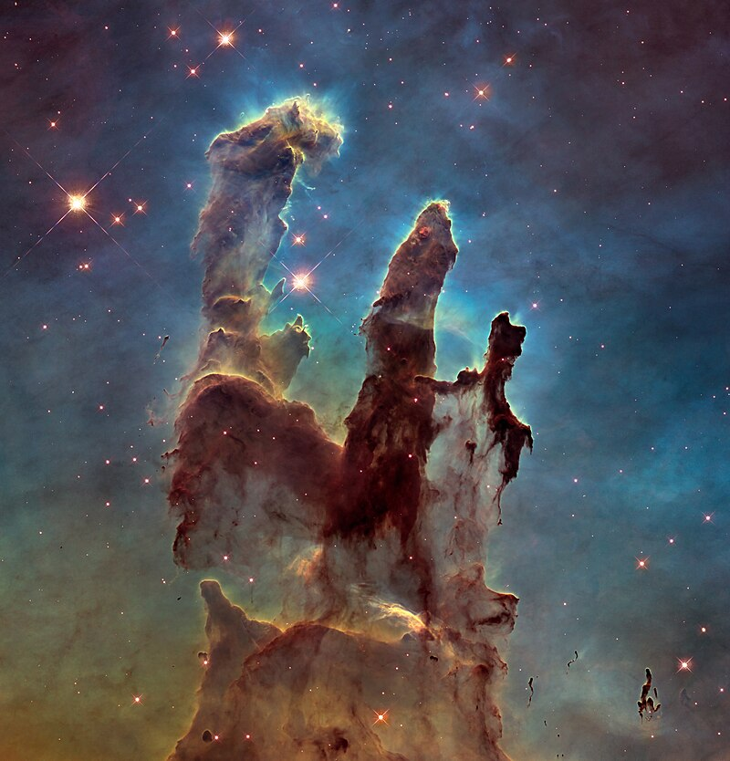
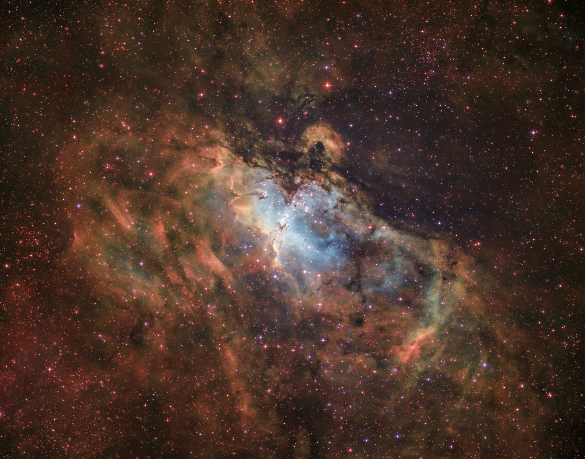

# The Pillars of Creation

The [Pillars of Creation](https://en.wikipedia.org/wiki/Pillars_of_Creation) as captured by the [Hubble Space Telescope](https://en.wikipedia.org/wiki/Hubble_Space_Telescope)

## Quick facts

- Constellation: Serpens
- Distance: 6.500 light-years
- Discovery: 1920 by [John Charles Duncan](https://en.wikipedia.org/wiki/John_Charles_Duncan)
- Image taken in: 2014 (Hubble Space Telescope)

## The photograph

Depicted are [elephant trunks](<https://en.wikipedia.org/wiki/Elephant_trunk_(astronomy)>), which are a type of interstellar matter formation, made of interstellar gas and dust within the [Eagle Nebula](https://en.wikipedia.org/wiki/Eagle_Nebula). They were first discovered by John Charles Duncan in 1920 and have since been photographed by the Hubble Space Telescope on numerous occasions.

The [Eagle Nebula](https://en.wikipedia.org/wiki/Eagle_Nebula), if looked at closely, one can see the Pillars of Creation in the middle of the nebula.

## The name

They are named _The Pillars of Creation_ because the gas and dust are in the process of creation new stars, while also being eroded by the light from nearby stars that have recently formed. It is based on a phrase used by [Charles Spurgeon](https://en.wikipedia.org/wiki/Charles_Spurgeon) in his 1857 sermon "The Condescension of Christ".

## Constellation

Cool [molecular hydrogen](https://en.wikipedia.org/wiki/Hydrogen) and dust are what makes up the three pillars. The aforementioned erosion process is conducted by [photoevaporation](https://en.wikipedia.org/wiki/Photoevaporation) from the [ultraviolet](https://en.wikipedia.org/wiki/Ultraviolet) light of nearby close and hot [stars](https://en.wikipedia.org/wiki/Star).
