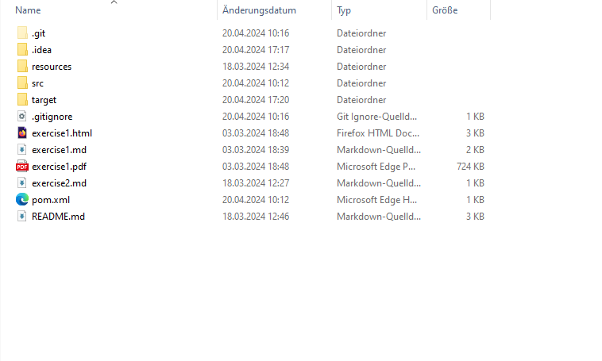
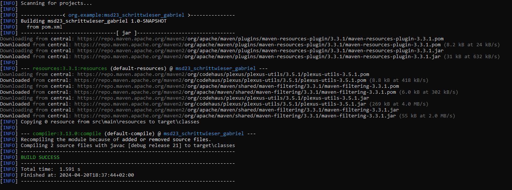
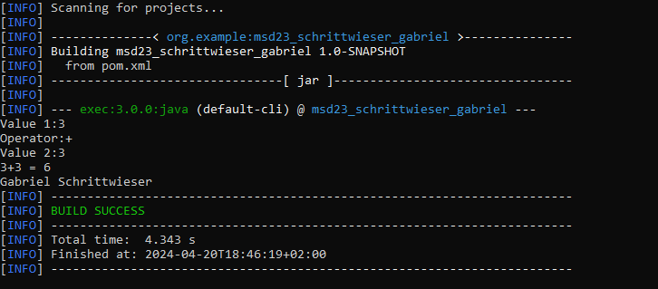

# Exercise 3

### Directory structure

After executing the Main-Method for the Calculator project, a folder named "target" was automatically created in the project directory.

### Maven Build

Console after creating the build using mvn compile

### Executing the Calculator

Console after using the calculator with the command mvn exec:java