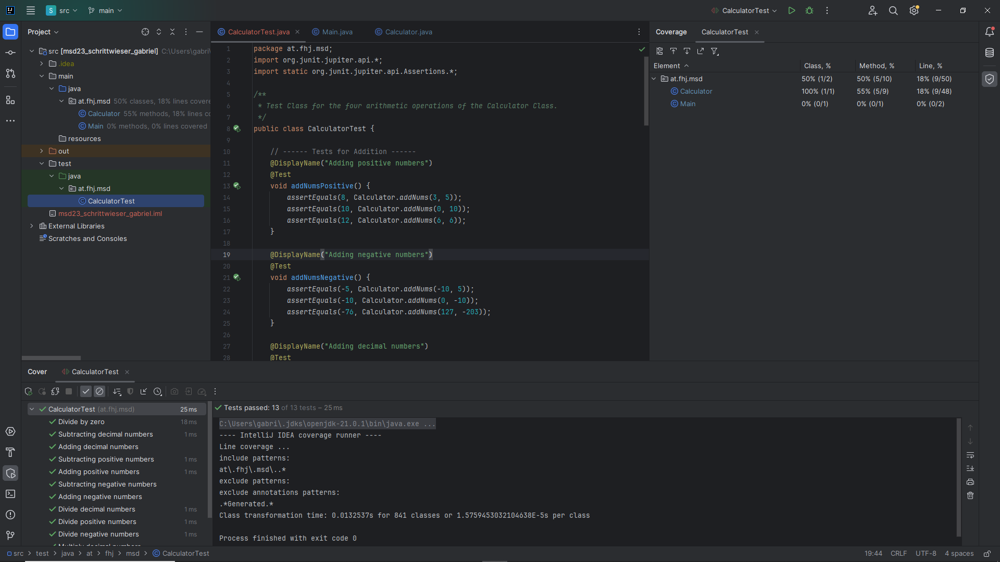
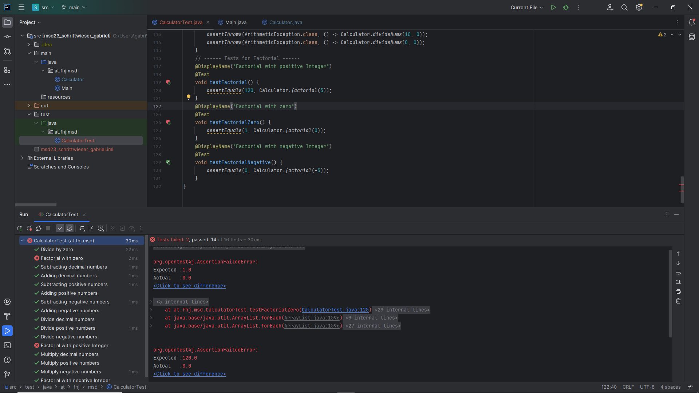

# Exercise 4
## Testing

---

### JUNIT Tests
The following cases are tested within the `CalculatorTest` Class:

- Addition with positive numbers
- Addition with negative numbers
- Addition with decimal numbers
- Subtraction with positive numbers
- Subtraction with negative numbers
- Subtraction with decimal numbers
- Multiplication with positive numbers
- Multiplication with negative numbers
- Multiplication with decimal numbers
- Division by positive numbers
- Division by negative numbers
- Division by decimal numbers
- Division by zero

---

### Testrun with coverage

---

### Factorial
A recursive `factorial` method was implemented, but was first set to only return 0 for testing purposes.

---

### Errors running factorial

