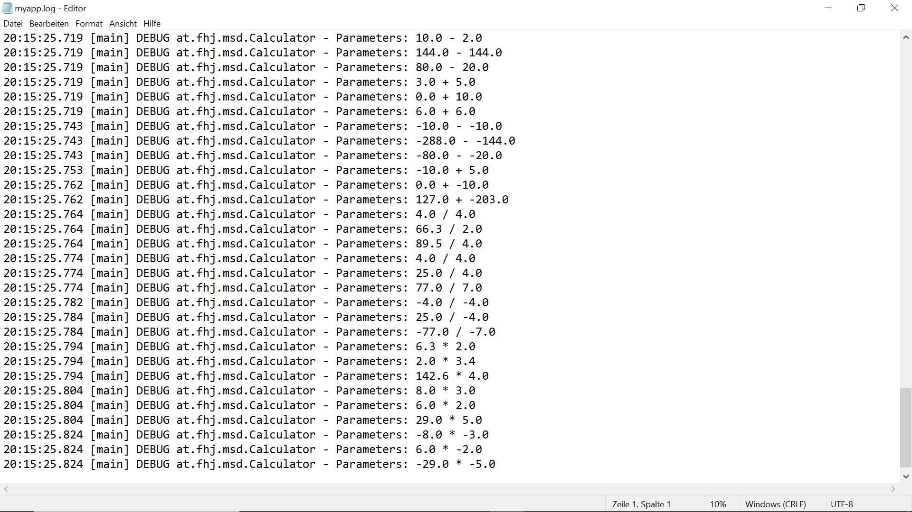

# Exercise 5

### Why do we use logging libraries?
Logging libraries assist in pinpointing the exact locations where errors or unexpected results occur, especially in large applications with multiple modules that communicate with each other. They are of great value for troubleshooting, optimization and maintenance.

### What Loglevels are there and what purpose do they serve?
As described in the provided Tutorial, the Log Levels are:
1. ALL - log all events
2. DEBUG - for debugging events
3. ERROR - an error in the app that may be recovered from
4. FATAL - a severe error that prevents the app from continuing
5. INFO - informational purposes
6. TRACE - used for capturing the flow throughout the application
7. WARN - warn of an error that might occur
8. OFF - log no events

The levels follow the order:
ALL < TRACE < DEBUG < INFO < WARN < ERROR < FATAL

### What options for configuration does log4J offer?
Using a configuration file offers several options such as:
 - Determining the level from which logs should be created. Whichever level is chosen also logs all levels below that, or in other words, to the right of the aforementioned list.
 - The pattern or format in which the logs should be displayed.
 - Whether the logs should be written to an external file, aswell as the name and location of said file. Also gives the option to either overwrite the file every time or append new logs to it.

---

# Working steps

---

### Gitignore

A rule for .log files was added to the .gitignore file

---

### Branch Logging & Log4j

Using `git checkout -b logging`, the logging branch was created and switched to. Then the Log4j dependencies for Apache Maven were taken from it's website and added to the pom.xml file.

Screenshot after executing `git status`:

---

### Logging
Within the `Main` method, a logging object was created and two loggers, one on the `Info` Level and another on the `Error` Level. Screenshot after executing the program:

Since we have not provided a configuration file and are thus using the default configuration, only the log from the `Error` Level is shown.

Each operation within the `Calculator` Class then got a Debug log, with an extra Error log for divison by zero. A `log4j2.xml` configuration file was then created to set up which levels should be logged and to what file, with append set to true so previous logs aren't overwritten.

Logs after executing the tests a few times:

---

### Documentation branch

A new branch called `documentation` was created. Screenshot of documentation branch with newly created exercise5.md.

